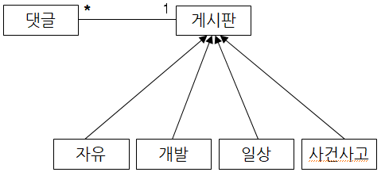

# 익명 의견 교환 웹 페이지

## 게시판 종류
- 전체 게시판
- 자유 게시판
- 개발 게시판
- 일상 게시판
- 사건 사고 게시판

## 구성
- 제목
- 글
- 비밀 번호
- 댓글

게시판에는 글 제목 조회  
글 제목 선택시 단일 조회

### 글 단일 조회 시 기능
- 글 수정
    - 글 작성 시 설정했던 비밀번호 필요
    - 본래 제목과 글이 존재
- 글 삭제
    - 글 작성 시 설정했던 비밀번호 필요
- 댓글 목록
- 댓글 추가
    - 작성 시 비밀번호 설정
- 댓글 삭제

## 도메인 모델과 테이블 설계

댓글과 게시판의 관계: 게시판에는 여러개의 댓글이 추가될수있다. 그러므로 게시판과 댓글은 1대n 관계이다.  

### 엔티티 분석

게시판(board): 제목(title), 내용(content), 비밀 번호(password), 댓글(comment)리스트와 타입(type)를 가진다
댓글(comment): 내용(content), 비밀 번호(password)을 가진다.

## ❗ 필수 기능 엔드포인트 (제안)
- 게시판 보기: `/boards/{:boardId}/`
- 게시글 작성하기: `/boards/{:boardId}/article/`
- 게시글 보기: `/article/{:articleId}`
- 게시글 수정하기: `/article/{:articleId}/update/`
- 게시글 삭제하기: `/article/{:articleId}/delete/`
- 댓글 작성하기: `/article/{:articleId}/comment/`

## 구현 고민점
- 타입별 게시판을 url에 적용
- 글 하나 확인 조회시 비밀전호를 수정과 삭제가 공유되도록
- 게시글 최신순 정렬
